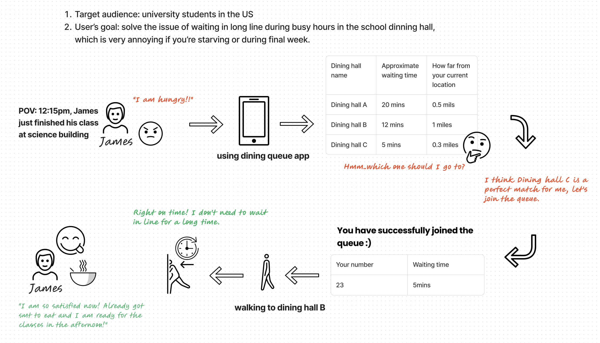
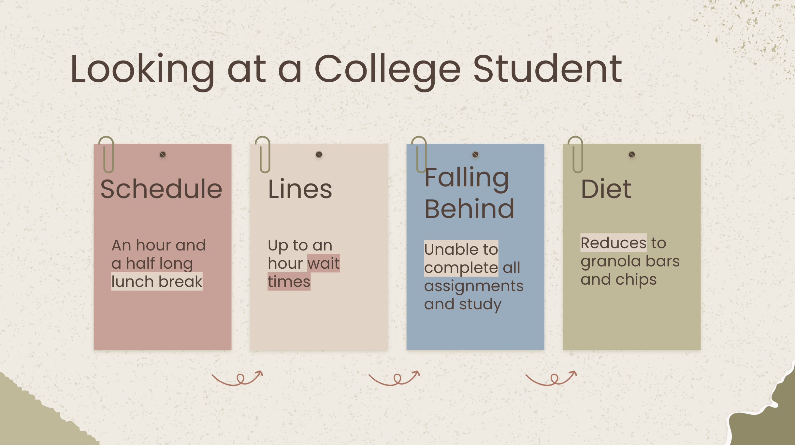
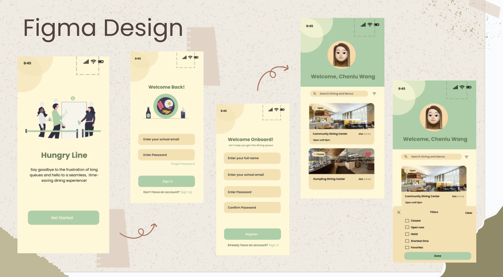
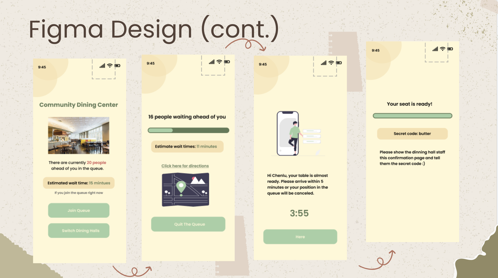

# Hungry Line

## Story Board

This depicts the life of an average college student attending a relatively large college, where the dining halls frequently become crowded during peak hours. Each day, he has a 90-minute gap between his classes allocated for lunch and studying, which he initially believes is ample time. He intends to complete some school assignments after his meal. However, on a daily basis, upon entering the dining hall, he is confronted with lengthy lines, sometimes spending up to an hour waiting. This leaves him with limited eating time and no opportunity to focus on his tasks. As this pattern continues during dinner hours, he realizes that, given his other commitments, dedicating a total of 4 hours a day for meals leaves him unable to complete all his work. Consequently, he gradually shifts his diet to quick and convenient options like granola bars and chips.

Through our research and interviews, we have identified time as the most significant barrier to maintaining a healthy diet among college students. Time holds immense value for these students. Our interviewees unanimously reported accomplishing minimal to no productive work while standing in dining hall lines. Nonetheless, dining halls remain the most accessible source of nutritious meals for students. In light of these findings, we have resolved to address this obstacle.

## About Hungry Line

"Hungry Line" is a React Native app designed for use on devices like iOS and Android. This app offers users the ability to queue online. It enables users to seamlessly join a dining hall line from any location and grants access to the dining hall when their turn arrives. This approach provides users with additional time for traveling to the dining hall and being more productive during the waiting period.

## Figma

We utilized Figma to design our application and opted for a warm color palette to evoke sensations of comfort and coziness. This choice aligns with our objective of creating an environment where users feel at home while navigating through our app.

## Demo
